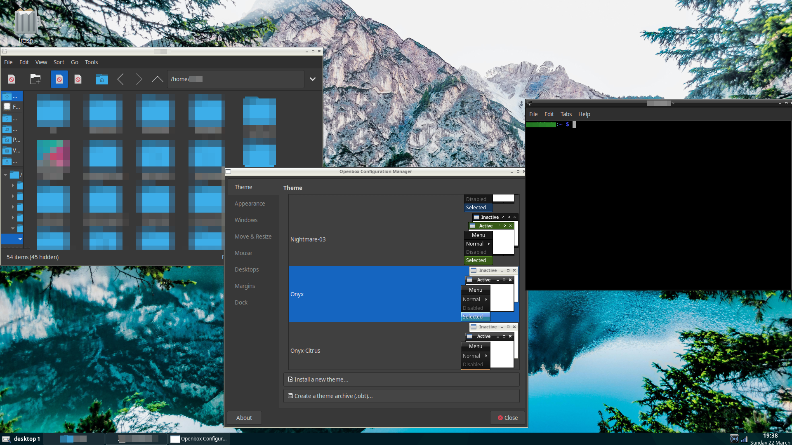

# ULDE
ULDE (Ultra-lightweight Desktop environment) is a desktop environment for Linux Debian.

It is made for really under-powered devices.
It uses:
- PCManFM in desktop mode
- Pulse Audio system tray
- Openbox
- Tint2
- NM-Applet
- jgmenu

To open up the app menu, right click on the taskbar.

# Requirements:
- Linux Debian / Pi OS / Ubuntu / other Debian based distros
- X11
- x86, x64, armhf or aarch64 architecture
- Low end hardware friendly
# To install:
1. Install LightDM by "sudo apt install lightdm"
2. Clone this repo by "git clone https://github.com/Xelron161/ULDE"
3. Install ULDE by "sudo dpkg -i ULDE/ulde.deb"
4. Install depends with "sudo apt --fix-broken install"
5. Reboot and you should be ready to go!
# Screenshot

